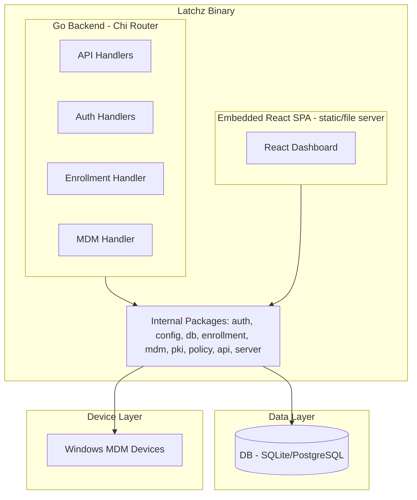
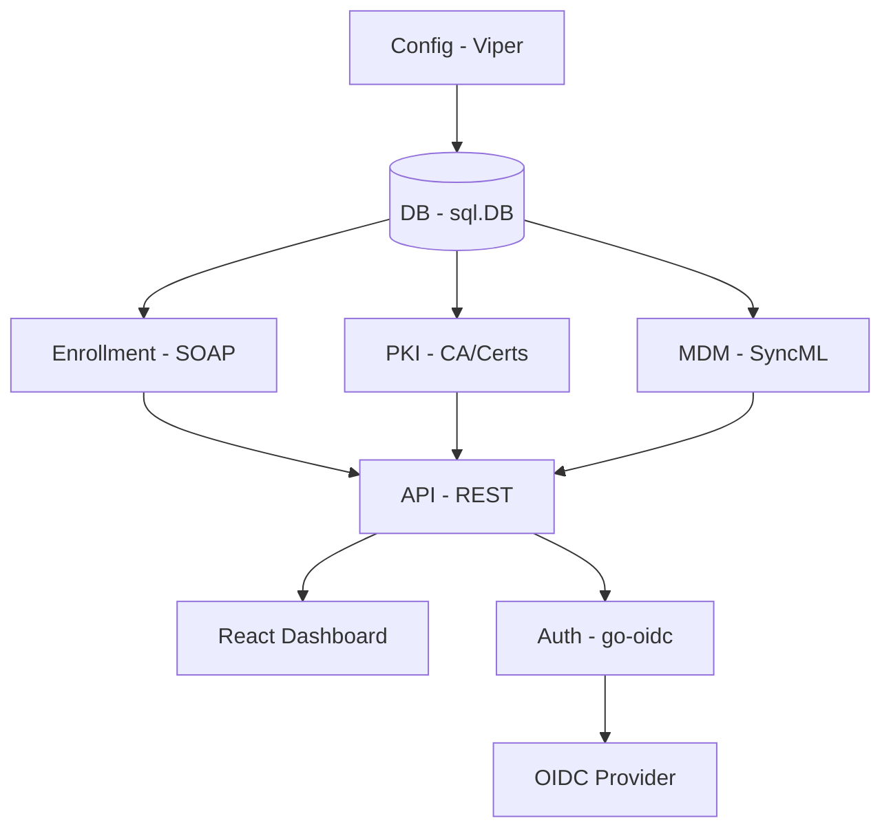
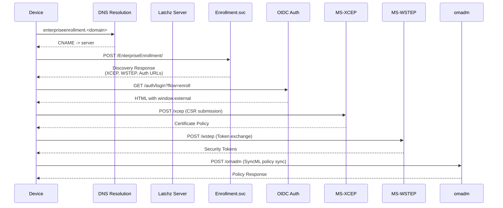

# System Patterns: Latchz MDM

## Architecture Overview

Latchz follows a **monolithic single-binary architecture** with an embedded React frontend. The Go backend serves both the REST API for dashboard administration and the proprietary Microsoft MDM protocol endpoints for device management.

## Key Technical Decisions

### 1. Chi Router for HTTP Layer
- Lightweight, composable router with middleware support
- No framework overhead, minimal dependencies
- Route groups for logical endpoint organization

### 2. Embedded SQL Migrations
- Migrations stored in `internal/db/migrations/` and embedded via `go:embed`
- Separate migration directories for SQLite and PostgreSQL
- `golang-migrate/v4` manages version tracking

### 3. Dual Database Support with Rebind
- Cross-compatible query layer using `dbpkg.Rebind()`
- SQLite uses `?` placeholders; PostgreSQL uses `$1, $2, ...`
- `DriverName` package-level variable tracks active engine

### 4. AES-256-GCM Key Encryption
- Root CA private key encrypted in database
- Encryption key derived from `server.master_secret` via SHA-256
- Nonce prepended to ciphertext in hex encoding

### 5. Four-Tier TLS Strategy
| Mode | Use Case | Requirements |
|------|----------|--------------|
| `auto` | Production | Port 80 + 443 exposed, valid domain |
| `manual` | Production | Pre-existing cert/key files |
| `self-signed` | Development | None |
| `none` | Behind proxy | Reverse proxy terminates TLS |

## Component Relationships

## Protocol Flow: Enrollment

## Critical Implementation Paths

### Starting the Server
1. `cmd/latchz/main.go` → `cmd/latchz/cmd/serve.go` → `server.New()` → `server.Run()`
2. Config loaded via `config.Load()` (Viper)
3. DB opened via `db.Open()` (runs migrations automatically)
4. CA loaded via `pki.Load()` (generates if missing)
5. Server created via `server.New()` (initializes all handlers and routes)
6. `server.Run()` selects TLS mode and starts listening

### Processing an Enrollment Discovery Request
1. Request hits `POST /EnterpriseEnrollment/Enrollment.svc`
2. `enrollment.Handler.HandleDiscovery()` parses SOAP envelope
3. Builds `DiscoverResponse` with server URLs
4. Applies XML namespace prefix replacements
5. Returns SOAP XML response

### Issuing a Device Certificate
1. Device sends CSR to `POST /xcep`
2. `enrollment.HandleXCEP()` validates CSR
3. `pki.CA.IssueDeviceCert()` signs CSR with root CA
4. Signed cert stored in `certificates` table
5. Cert PEM returned to device

## Design Patterns in Use

| Pattern | Where | Purpose |
|---------|-------|---------|
| Singleton | `pki.CA`, `db.DB` | Single CA instance, single DB connection pool |
| Factory | `enrollment.NewHandler()`, `auth.New()` | Initialize handlers with dependencies |
| Strategy | TLS modes | `auto`/`manual`/`self-signed`/`none` interchangeable |
| Middleware | Chi middleware chain | Request ID, logging, recovery, auth |
| Repository | `internal/api/` handlers | Data access embedded in API handlers |
| Builder | `config.Load()` | Complex config assembly with validation |

## Security Considerations

- **CA Key Protection**: Root CA key encrypted at rest; `master_secret` loss = permanent data loss
- **Emergency Access**: `/emergency?token=<secret>` bypasses auth for admin recovery
- **mTLS**: Enrolled devices authenticate via client certificates signed by Latchz's CA
- **JWT Sessions**: OIDC auth produces short-lived JWT sessions
- **Enrollment Tokens**: WSTEP requires valid enrollment tokens from OIDC flow