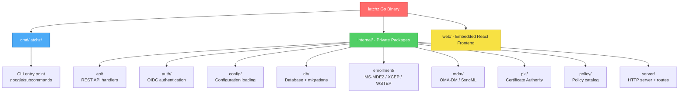

# Tech Context: Latchz MDM

## Languages

- **Go** — Backend server, API, MDM protocol handlers
- **TypeScript** — React dashboard frontend
- **SQL** — Database migrations for SQLite and PostgreSQL

## Backend: Go 1.26+

### Core Dependencies

| Package | Purpose |
|---------|---------|
| `github.com/go-chi/chi/v5` | HTTP router |
| `github.com/spf13/viper` | Configuration management |
| `github.com/coreos/go-oidc/v3` | OIDC client for dashboard auth |
| `github.com/golang-jwt/jwt/v5` | JWT token generation/validation |
| `github.com/golang-migrate/migrate/v4` | Database migrations |
| `github.com/google/uuid` | UUID generation |
| `github.com/lib/pq` | PostgreSQL driver |
| `modernc.org/sqlite` | CGo-free SQLite driver |
| `golang.org/x/oauth2` | OAuth2 client library |
| `golang.org/x/crypto` | Cryptographic utilities |
| `gopkg.in/yaml.v3` | YAML config parsing |

### Build

```bash
make all          # Build frontend + backend
make dev          # Start Go server in dev mode (watch)
./latchz serve    # Run the server
```

### Binary Structure



## Frontend: React 19 + TypeScript

### Dependencies

| Package | Purpose |
|---------|---------|
| `react` / `react-dom` | UI framework (v19) |
| `react-router-dom` | Client-side routing |
| `recharts` | Charts and dashboards |
| `lucide-react` | Icon library |

### Dev Dependencies

| Package | Purpose |
|---------|---------|
| `vite` | Build tool and dev server (v8) |
| `typescript` | Type checking |
| `typescript-eslint` | Linting |
| `@vitejs/plugin-react` | React JSX support |

### Frontend Build

```bash
cd web
npm run dev        # Start Vite dev server with HMR (port 5173)
npm run build      # Production build (go embed picks this up)
npm run preview    # Preview production build
```

## Development Setup

### Prerequisites

- Go 1.26+
- Node.js 18+ (for frontend)
- Make (optional, for build commands)

### Configuration

Config file: `latchz.yaml` (copy from `latchz.example.yaml`)

Environment variables use `LATCHZ_` prefix with underscores replacing dots:

| Env Var | Config Key | Default |
|---------|-----------|---------|
| `LATCHZ_SERVER_DOMAIN` | `server.domain` | `localhost:8443` |
| `LATCHZ_SERVER_ENROLLMENT_DOMAIN` | `server.enrollment_domain` | _(empty)_ |
| `LATCHZ_SERVER_MASTER_SECRET` | `server.master_secret` | _(required for CA)_ |
| `LATCHZ_SERVER_EMERGENCY_TOKEN` | `server.emergency_token` | _(required for rescue)_ |
| `LATCHZ_TLS_MODE` | `tls.mode` | `self-signed` |
| `LATCHZ_DATABASE_DRIVER` | `database.driver` | `sqlite` |
| `LATCHZ_DATABASE_DSN` | `database.dsn` | `./latchz.db` |
| `LATCHZ_AUTH_PROVIDER` | `auth.provider` | `oidc` |
| `LATCHZ_AUTH_OIDC_ISSUER` | `auth.oidc.issuer` | _(required for OIDC)_ |
| `LATCHZ_AUTH_OIDC_CLIENT_ID` | `auth.oidc.client_id` | _(required for OIDC)_ |
| `LATCHZ_AUTH_OIDC_CLIENT_SECRET` | `auth.oidc.client_secret` | _(required for OIDC)_ |
| `PORT` | (standard) | _(cloud platform override)_ |

Config file search paths: `./latchz.yaml`, `$HOME/.latchz/latchz.yaml`, `/etc/latchz/latchz.yaml`

### Database

**SQLite (development):**
- File-based, zero external dependency
- WAL mode enabled for better concurrency
- Max 10 open connections

**PostgreSQL (production):**
- Use `github.com/lib/pq` driver
- Connection string via `database.dsn`
- Parameterized query conversion via `Rebind()`

## External Services

### OIDC Providers (for dashboard auth)

- **Google Workspace** — Issuer: `https://accounts.google.com`
- **Entra ID (Azure AD)** — Issuer: `https://login.microsoftonline.com/{tenant}`
- **Okta** — Issuer: `https://{yourDomain}.okta.com`

### Let's Encrypt (for auto TLS)

- Requires port 80 exposed to the internet
- ACME HTTP-01 challenge
- Certificates cached in `tls.cache_dir` (default: `./certs`)
- Automatic renewal handled by ACME library

### Microsoft DDF (for policy catalog)

- Device Description Framework XML files define available MDM policies
- A Python ingestion script parses these into the `policy_catalog` table
- Maps OMA-DM CSP URIs to human-readable policy definitions
- Required fields: `oma_uri`, `data_type`, `allowed_values`

## Deployment Targets

| Target | Method | Notes |
|--------|--------|-------|
| Docker | `Dockerfile` provided | Single binary + nginx for static files |
| Bare metal | `make all` → `./latchz` | Pre-compiled Go binary |
| Cloud Run | `LATCHZ_TLS_MODE=none` | Proxy terminates TLS |
| Kubernetes | Custom deployment | Binary + configmap + DB |

## Key Commands

```bash
# Build everything
make all

# Development (Go server with file watch)
make dev

# Run server
./latchz serve

# Frontend development
cd web && npm run dev

# Build frontend only
cd web && npm run build

# Lint
cd web && npm run lint